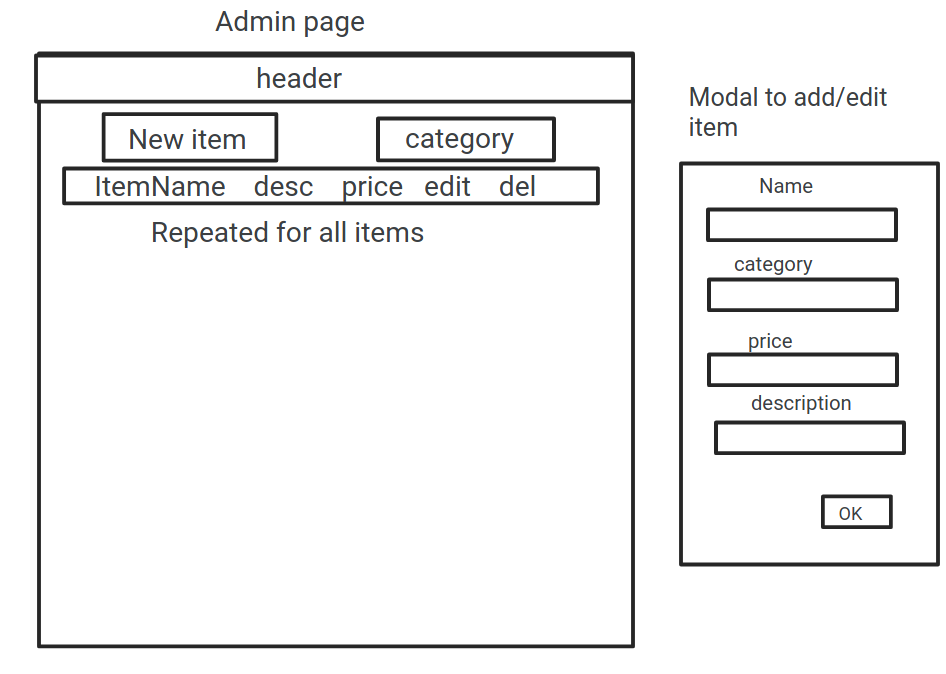

# AHHA group project

This project was created by [Heather P](https://github.com/hpaterson97), [Alfonso R](https://github.com/alfonsoristoratoSky), [Abdi A](https://github.com/CodeFeeZilla), and [Harvey C](https://github.com/BokChoyWarrior).

## Contents

- [How to run](https://github.com/BokChoyWarrior/ahha-mv-project#how-to-run-project)
- [Features](https://github.com/BokChoyWarrior/ahha-mv-project#features)
- [Project Design](https://github.com/BokChoyWarrior/ahha-mv-project#project-design)
- [Planning](https://github.com/BokChoyWarrior/ahha-mv-project#planning)
- [Group Responsibilities](https://github.com/BokChoyWarrior/ahha-mv-project#group-responsibilities)
- [Requirements](https://github.com/BokChoyWarrior/ahha-mv-project#requirements)

---

Our project consists of two main directories: `frontend/` and `backend/`. They contain applications for the react app and express REST API respectively.

## How to run project

Once you've cloned the project, you will have to run two separate terminals. One for backend, and one for frontend.

### Backend

1. `cd backend/`
2. `npm i`
3. `npm start`

### Frontend

In a new terminal:

1. `cd frontend/`
2. `npm i`
3. `npm start`

Runs the app in the development mode.\
Open [http://localhost:5000](http://localhost:5000) to view it in the browser.

The app comes with a pre-seeded database with four categories containing items, and two users.

[**⬆ Back to contents ⬆**](https://github.com/BokChoyWarrior/ahha-mv-project#contents)

## Brief overview

## Features

### Login system 🕵🏻‍♂

In the top right, you will see two buttons: Login and Signup.
Users can sign in with their user ID by clicking the login button and entering their user ID. User ID 1 and 2 already exist.

Alternatively, you can sign up as a new user. Simply enter your username on the signup page and you will be assigned a **user ID** and logged in. Please use the **user ID** you were assigned to login from now on.

### Admin page 👩🏽‍🔧

The admin page supports all CRUD operations on items. Simply head over to [http://localhost:5000/admin](http://localhost:5000/admin) to test it out! (No login required)

### Simple interface to view items/categories 🛍

When you open the app, you will see an interface containing all categories.

Simply click on a category to be taken to that category's items page. If the user isn't logged in and they try to add an item to the cart, they will be redirected to the login page.

_Note: Categories/Items are pulled from the database and not hard-coded._

### Cart functionality 🛒

If the user _is_ logged in (reminder: login with userID `1`), they should be able to add/remove items from their cart. **Try refreshing the page or closing the browser to see the cart and login session persist!**

### More cart functionality!

If you ever want to view all the items in your cart, simply click on the **My Cart** button and here you will be able to edit to your heart's desire.

[**⬆ Back to contents ⬆**](https://github.com/BokChoyWarrior/ahha-mv-project#contents)

## Project Design

We tried to use general best practices in React, but because we were all still learning we lacked the time to consolidate our knowledge and refactor as much as would have been helpful.

The whole login system is incredibly insecure because we were looking for a proof-of-concept for the cart system. In a development app, we would probably use JWT which would be sent with every API request. For now, the user's ID is stored in the browser's localStorage (to persist sessions similar to cookies) and authenticated once per page load.

### Tools used

For the express API

- ExpressJS
- SQLite database
- Sequelize to handle database models and table relationships.

For the react app we used quite a few libraries.

- React
- React router for clientside routing
- Bootstrap for styling (and many React+Bootstrap libraries for pre-built React components)
- Axios for making asynchronous API requests.

General tools:

- VSCode
- LiveShare (VSCode extension)
- Git
- Prettier
- ESLint in both front and backend.
- GitHub projects to manage the TODO list of requirements and assigning tasks.

**ESLint** and **Prettier** both helped our collaboration in git because code style was enforced, meaning no whitespace commit changes when viewing the git diff.

[**⬆ Back to contents ⬆**](https://github.com/BokChoyWarrior/ahha-mv-project#contents)

## Planning

[**⬆ Back to contents ⬆**](https://github.com/BokChoyWarrior/ahha-mv-project#contents)

### UI Wireframes

[**⬆ Back to contents ⬆**](https://github.com/BokChoyWarrior/ahha-mv-project#contents)

## Group responsibilities

It's safe to say we all learned something from this project. At the time of writing, each of us has, at some point, worked with every other person on a feature. This meant that we were able to learn from each other while also catching mistakes early.

Despite working 100% remote, the full-time zoom call enabled us to catch up multiple times per day and make sure we all had something to work on and could identify any blockers early.

### Backend

- Creating models
  - Everyone
- Creating most of the API
  - Heather + Alfonso
- Testing
  - Heather

### Frontend

- Homepage
  - Harvey + Abdi
- Login pages/system
  - Heather + Harvey
- Admin page
  - Alfonso
- Category page + logic
  - Abdi + Harvey + Heather
- Cart page
  - Abdi
- Responsive design
  - Everyone (helped by Bootstrap)

### Misc.

- README
  - Harvey
- Code documentation
  - Abdi

[**⬆ Back to contents ⬆**](https://github.com/BokChoyWarrior/ahha-mv-project#contents)

## Requirements

### Functional requirements

- [x] **F1** - The application must support at least 4 categories; electronics, jewelery, men's clothing, women's clothing
- [x] **F2** - The application must display as a minimum, an image, price and description of each item
- [x] **F3+F4** - The application must allow for items to be added/removed to/from a shopping cart
- [x] **F5** - The shopping cart must persist its state when the browser is closed
- [x] **F6** - The application must work well on a mobile as well as a desktop device
- [x] **F7** - (optional) - The application should support an admin interface to allow for new items to be uploaded for sale
- [x] **F8** - (optional) - The application should support an admin interface to allow for item descriptions to be updated
- [x] **F9** - optional) - The application should support an admin interface to allow for items to be removed from sale

### Non-Functional requirements

- [x] **NF1** - The application must have client & server-side validation in place
- [x] **NF2** - The application must have evidence of automated unit testing
- [ ] **NF3** - The application code must be documented in a manner that it would be easy for a new developer to understand
- [x] **NF4** - The application code must be stored in a GitHub repository - Well, here you are!
- [ ] **NF5** - There must be documentation which describes these features:
- how to run the application
- features of the application
- design decisions
- team roles & responsibilities
- links to UI wireframes
- links to UML use case, class and sequence diagrams
- links the the database design
- links to a unit test coverage report

[**⬆ Back to contents ⬆**](https://github.com/BokChoyWarrior/ahha-mv-project#contents)

### Testing section

For now we only have created tests for the backend API due to time constraints.

// TODO
